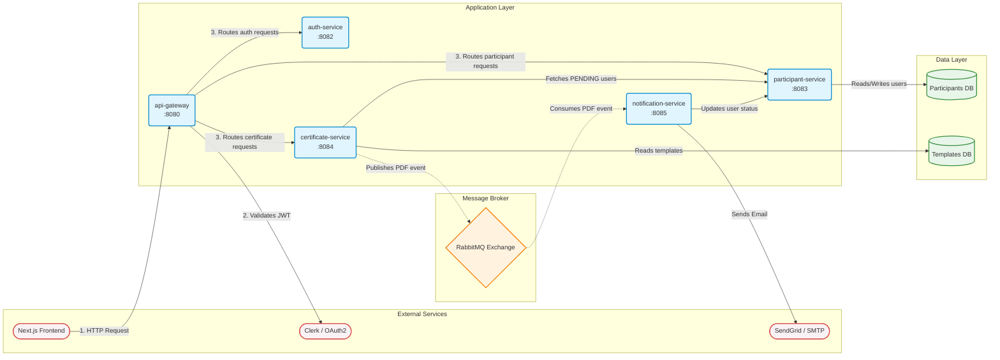
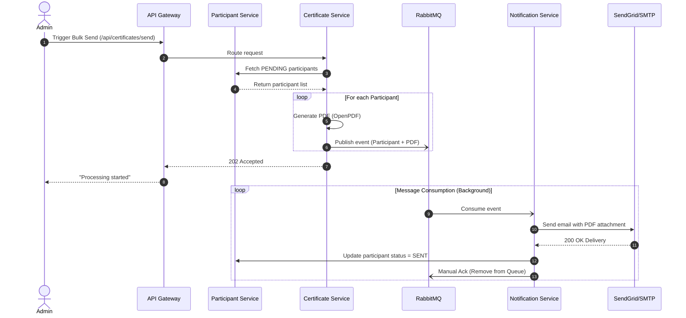

# 📧 One-Click EmailSender & Certificate Generator

[](https://spring.io/projects/spring-boot)
[](https://spring.io/projects/spring-cloud)
[](https://www.rabbitmq.com/)
[](https://nextjs.org/)
[](https://www.oracle.com/java/)
[](https://clerk.com/)

> An enterprise-ready, high-performance, full-stack application designed to automate the dynamic generation of personalized PDF certificates and distribute them via email to thousands of participants in seconds.

---

## 📋 Table of Contents

- [Overview](#overview)
- [Key Features](#key-features)
- [Technology Stack](#technology-stack)
- [Microservices Architecture](#microservices-architecture)
- [Service-by-Service Breakdown](#service-by-service-breakdown)
- [End-to-End Workflow](#end-to-end-workflow)
- [Setup & Installation](#setup--installation)

---

## 🎯 Overview

**One-Click EmailSender** is a comprehensive backend and frontend solution for organizations that need to:
- Upload participant data from Excel files (`.xlsx`)
- Dynamically generate personalized PDF certificates via base templates
- Send certificates via email to thousands of recipients without blocking the UI
- Track delivery status (`PENDING`, `SENT`, `FAILED`) in real-time
- Handle failures gracefully with automatic SMTP fallback mechanisms and RabbitMQ Dead Letter Queues

The application combines a modern, interactive **Next.js & Tailwind CSS** frontend with a robust, distributed **Spring Boot 3 Microservices** backend. Using RabbitMQ, it fully decouples heavy PDF generation from network-bound email dispatching to guarantee high throughput and fault tolerance during massive email campaigns.

---

## ⚡ Key Features

| Feature | Description |
|---------|-------------|
| **Excel Importing** | Upload thousands of participants in a single click using `.xlsx` files with Apache POI |
| **Virtual Template Calibration** | Upload base PDF templates and dynamically calibrate coordinates via an interactive UI |
| **Microservices & Messaging** | Offloads email dispatch to RabbitMQ, ensuring instant API feedback and zero HTTP timeouts |
| **Intelligent Auto-Fallback** | Primary SendGrid API with automatic fallback to SMTP (Mailjet/Local) for high resilience |
| **Secure OAuth2** | Clerk-powered authentication with stateless JWT validation at the API Gateway layer |
| **Real-time Tracking** | Monitor certificate generation and email delivery status with live dashboard updates |
| **Reliability** | Manual message acknowledgments and Dead Letter Queues (DLQ) for absolute delivery guarantees |

---

## 🏗️ Technology Stack

### **Frontend**
- **Framework:** Next.js 14+ (React Server Components, App Router)
- **Styling:** Tailwind CSS + Glassmorphism design tokens
- **HTTP Client:** Axios with interceptors for JWT header injection
- **Authentication:** Clerk React SDK (OAuth2)
- **Language:** TypeScript

### **Backend (Spring Boot Microservices)**
- **Framework:** Spring Boot 3.3.x, Spring Cloud Gateway (Java 17)
- **Messaging Broker:** RabbitMQ (Spring AMQP)
- **Database:** MySQL 8.0+ with Spring Data JPA/Hibernate
- **Security:** Spring Security + OAuth2 Resource Server (Clerk JWT)
- **PDF Generation:** OpenPDF (on-the-fly certificate rendering)
- **Email Delivery:** SendGrid REST API + JavaMail SMTP Fallback
- **Build Tool:** Maven (Multi-module structure)

---

## 🔌 Microservices Architecture

The system uses a distributed microservices approach connected via a RabbitMQ message broker.



---

## 🏗️ Service-by-Service Breakdown

### 1. `api-gateway` (Port 8080)
- **Role:** The front door (Reverse Proxy) for all frontend requests.
- **Responsibilities:** Validates the user's JWT via Clerk, enforces global CORS policies, and securely routes requests to downstream microservices. Hides internal architecture from the outside world.

### 2. `auth-service` (Port 8082)
- **Role:** Centralized security hub.
- **Responsibilities:** Owns global OAuth2 Resource Server configurations. Integrates with the `common-lib` and Clerk JWKS endpoints to provide stateless authentication logic across the ecosystem.

### 3. `participant-service` (Port 8083)
- **Role:** Participant data management.
- **Responsibilities:** Parses uploaded Excel sheets (`.xlsx`), stores participants in the MySQL database, and tracks real-time status updates (`PENDING`, `SENT`, `FAILED`).

### 4. `certificate-service` (Port 8084)
- **Role:** PDF Generation & Messaging Producer.
- **Responsibilities:** Manages the certificate templates and calibration text alignments. During a bulk send, it fetches pending participants, generates personalized OpenPDF documents in-memory, and **publishes asynchronous `CertificateEvent` messages to RabbitMQ**.

### 5. `notification-service` (Port 8085)
- **Role:** Background worker & Messaging Consumer.
- **Responsibilities:** Contains no public HTTP endpoints. It reliably consumes messages from RabbitMQ, connects to SendGrid, attaches the PDF, and dispatches the email (falling back to SMTP if necessary). Makes REST calls back to `participant-service` to confirm delivery.

### 6. `common-lib`
- **Role:** Shared dependencies (`.jar`).
- **Responsibilities:** Universal DTOs, Enums, standardized API responses, and the `GlobalExceptionHandler` to prevent code duplication across the ecosystem.

---

## 🔄 End-to-End Workflow

1. **Authentication:** An admin logs into the Next.js frontend using Google OAuth2 (via Clerk). The client receives a JWT and attaches it to all HTTP requests as a `Bearer` token.
2. **Data Ingestion:** Admin uploads an Excel sheet. The `api-gateway` routes this to the `participant-service`, persisting the rows with a status of `PENDING`.
3. **Template Preparation:** Admin uploads a blank certificate. This routes to the `certificate-service`, activating the template and calibrating text fields.
4. **Triggering the Bulk Send:** Admin clicks "Send All Certificates". The gateway routes this `POST` request to the `certificate-service`.
5. **PDF Generation:** The `certificate-service` requests all pending participants from the `participant-service`. For each, it instantly generates a personalized PDF in-memory.
6. **Async Handoff:** The `certificate-service` publishes a `CertificateEvent` (including the PDF byte array) to RabbitMQ. It immediately returns a `202 Accepted` to the frontend, ensuring the UI remains completely unblocked.
7. **Email Dispatch:** Over in the background, the `notification-service` consumes the messages, sends the emails via SendGrid (or SMTP fallback), and updates the user's status to `SENT` via a REST call to `participant-service`.
8. **Acknowledgment:** The `notification-service` acknowledges the message to RabbitMQ. In case of fatal errors, it routes the message to a Dead Letter Queue (DLQ).



---

## 🚀 Setup & Installation

### Prerequisites
- Docker & Docker Compose (Recommended)
- Java 17+ (If running locally)
- Node.js 18+ (For frontend)
- RabbitMQ
- MySQL 8.0+

### Environment Variables
Copy `.env.example` to `.env` in both the `frontend/` and `backend/` directories, and fill in the required API keys for Clerk, SendGrid, and MySQL configurations.

### Running with Docker (Easiest)
```bash
docker-compose up --build -d
```
The application will launch on:
- Frontend: `http://localhost:3000`
- API Gateway: `http://localhost:8080`
- RabbitMQ Dashboard: `http://localhost:15672` (if enabled in compose)

### Running Locally (Without Docker)

1. **Start Infrastructure:** Ensure MySQL and RabbitMQ are running locally on their default ports.
2. **Build Common Lib:**
   ```bash
   cd backend
   ./mvnw clean install -pl common-lib
   ```
3. **Run Microservices:** Use the provided `.bat` scripts or run each module independently via Maven.
   ```bash
   ./run_backend.bat
   ```
4. **Start Frontend:**
   ```bash
   cd frontend
   npm install
   npm run dev
   ```

---
> Made with ☕ and ❤️ for high-throughput certificate delivery.
