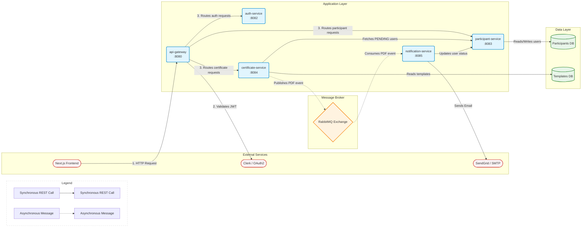
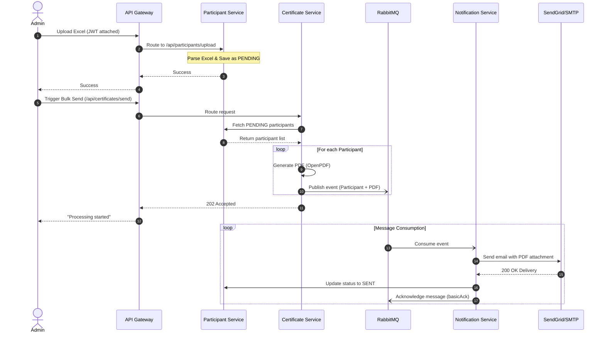

# Certificate Email Sender - Microservices Backend

## 1. Project Overview

The **Certificate Email Sender** is a robust backend system designed to solve the logistical challenge of bulk-generating and distributing personalized PDF certificates to event attendees. Built for event organizers and administrators, it allows users to quickly upload participant data via Excel, dynamically generate customized certificates using base templates, and reliably dispatch them via email. By leveraging a distributed microservices architecture, the system guarantees high throughput, fault tolerance, and unblocked user interfaces during massive email campaigns.

**Key Highlights:**
- 🔒 **OAuth2 Security:** Secured via Clerk (Google OAuth2), utilizing stateless JWT validation at the API Gateway layer.
- ⚡ **Asynchronous Messaging:** Utilizes RabbitMQ to decouple heavy PDF generation from network-bound email dispatching.
- 📄 **Bulk PDF Generation:** Employs OpenPDF for rapid, on-the-fly certificate rendering based on customizable templates and alignment settings.
- 📊 **Status Tracking:** Maintains a reliable lifecycle state (`PENDING`, `SENT`, `FAILED`) for every participant, driven by manual message acknowledgments.
- 🛡️ **Fault Tolerance:** Features robust error handling, SMTP fallbacks for email delivery, and Dead Letter Queues (DLQ) for failed messaging operations.

---

## 2. Tech Stack

| Layer | Technology |
| :--- | :--- |
| **Language** | Java 17 |
| **Framework** | Spring Boot 3.3.x, Spring Cloud Gateway |
| **Security** | Spring Security, OAuth2 Resource Server, Clerk (JWT) |
| **Messaging** | RabbitMQ (Spring AMQP) |
| **Database** | MySQL (Spring Data JPA, Hibernate) |
| **PDF Generation** | OpenPDF |
| **Email Delivery** | SendGrid API (with JavaMail SMTP fallback) |
| **Data Parsing** | Apache POI (Excel integration) |
| **Build Tool** | Maven (Multi-module structure) |

---

## 3. Architecture Diagram



### How to Read This Diagram
Requests enter through the **API Gateway** on the far left, which acts as the front door for the system. The gateway checks if the user's JWT is valid (via Clerk) and then routes the request to the appropriate microservice in the **Application Layer**. When an admin triggers a massive bulk email send, the `certificate-service` generates the PDFs and hands off the heavy email-sending work asynchronously to **RabbitMQ** (indicated by dashed arrows). Finally, the `notification-service` picks up these tasks one by one, dispatches the emails via SendGrid, and loops back to update the participant's status in the database.

---

## 4. Service-by-Service Breakdown

### `api-gateway` (Port 8080)
- **Owns:** Edge routing configuration and global CORS policies.
- **Exposes:** All downstream API endpoints (`/api/participants/**`, `/api/certificates/**`, `/api/templates/**`).
- **Depends on:** Clerk (for JWT validation) and all internal services (for routing).
- **Responsibility:** Acts as the single entry point and reverse proxy for all frontend requests, abstracting away the internal microservice topology and centralizing edge security.

### `auth-service` (Port 8082)
- **Owns:** Global OAuth2 Resource Server configurations.
- **Exposes:** Internal authentication utilities and intercepts `/api/auth/**` routes.
- **Depends on:** `common-lib` and Clerk JWKS.
- **Responsibility:** Centralizes Spring Security configurations and authentication logic to be shared or referenced across the ecosystem.

### `participant-service` (Port 8083)
- **Owns:** The `participants` database schema and the `Participant` entity lifecycle.
- **Exposes:** CRUD endpoints for participants, bulk Excel upload API, and an internal status update API.
- **Depends on:** MySQL DB.
- **Responsibility:** Core data management for event participants, handling everything from Excel sheet parsing to database persistence and status tracking.

### `certificate-service` (Port 8084)
- **Owns:** The `certificate_templates` database schema, calibration settings, and the PDF generation engine (OpenPDF).
- **Exposes:** Template upload/calibration APIs and the bulk trigger APIs (`/api/certificates/send`).
- **Depends on:** `participant-service` (via REST), RabbitMQ (to publish events), and MySQL DB.
- **Responsibility:** Manages base certificate templates, fetches pending users, generates personalized PDF documents on demand, and publishes messaging events.

### `notification-service` (Port 8085)
- **Owns:** The SendGrid API integration and JavaMail SMTP fallback logic.
- **Exposes:** No public APIs (strictly a background worker).
- **Depends on:** RabbitMQ (consumes messages), SendGrid (external API), and `participant-service` (via REST).
- **Responsibility:** Reliably consumes background tasks and dispatches emails with attachments, ensuring no participant is left behind.

### `common-lib`
- **Owns:** Universal DTOs (`ParticipantResponse`, `CertificateEvent`), enums (`Status`), standard `ApiResponse` objects, and a unified `GlobalExceptionHandler`.
- **Exposes:** Java classes as a reusable `.jar` dependency.
- **Depends on:** None.
- **Responsibility:** A shared dependency module that prevents code duplication across the ecosystem and enforces standardized API responses.

---

## 5. End-to-End Workflow

This is the complete narrative of how a request flows through the system during a standard bulk-send operation:

1. **Authentication:** An admin logs into the Next.js frontend using Google OAuth2 (via Clerk). The client receives a JWT and attaches it as a `Bearer` token to all backend HTTP requests.
2. **Edge Security Validation:** A request hits the `api-gateway`. The gateway intercepts it, validates the JWT's signature against Clerk's public keys, checks CORS, and securely routes it to the target microservice.
3. **Data Ingestion:** The admin uploads an Excel sheet of attendees. The gateway routes this to the `participant-service`, which parses the rows and persists the users in the database with an initial status of `PENDING`.
4. **Template Preparation:** The admin uploads a blank certificate design via the UI. This routes to the `certificate-service`, which activates the template and calibrates text alignments.
5. **Triggering the Bulk Send:** The admin clicks "Send All Certificates". The gateway routes this `POST` request to the `certificate-service`.
6. **Data Retrieval:** The `certificate-service` makes a synchronous REST call to the `participant-service` requesting all participants marked as `PENDING`.
7. **Document Generation:** For every pending participant, the `certificate-service` uses OpenPDF to instantly stamp their name and event details onto the active template in-memory. 
8. **Asynchronous Messaging:** The `certificate-service` packages the participant's metadata and the raw PDF byte array into a `CertificateEvent` and **publishes it to RabbitMQ**. The HTTP request immediately returns a `202 Accepted` to the frontend, keeping the UI completely unblocked.
9. **Email Dispatch:** Over in the background, the `notification-service` consumes the `CertificateEvent` messages from the queue. It connects to SendGrid, attaches the PDF, and sends the email (falling back to SMTP if SendGrid fails).
10. **State Reconciliation:** Once the email is successfully transmitted, the `notification-service` makes a REST call back to the `participant-service` to update the user's status to `SENT`. 
11. **Final Acknowledgment:** The `notification-service` manually acknowledges (`basicAck`) the message to RabbitMQ, permanently removing it from the queue. If a critical failure occurs, it rejects the message (`basicNack`), routing it to the Dead Letter Queue (DLQ) for manual review.

### Workflow Sequence Diagram



---

## 6. RabbitMQ Message Flow Details

The messaging topology is designed to ensure no emails are lost during system outages or API rate limits.

- **Exchange:** `certificate.send.exchange` (Direct Exchange)
- **Queue:** `certificate.send.queue` (Durable)
- **Routing Key:** `certificate.send.key`
- **Dead Letter Exchange (DLX):** `certificate.dlx`
- **Dead Letter Queue (DLQ):** `certificate.send.dlq` (Routing Key: `certificate.send.dlq.key`)

**Why Manual Acknowledgments?**
The `notification-service` is configured with `acknowledge-mode=manual`. A message is only acknowledged and removed from RabbitMQ *after* the email successfully dispatches AND the database status is successfully updated to `SENT`. If the service crashes mid-process, the unacknowledged message remains in the queue for the next available worker. If an unrecoverable exception occurs, the message is manually rejected (`basicNack`) without requeueing, pushing it directly to the DLQ for administrator inspection.

**Why RabbitMQ over Kafka?**
This system relies on a classic work-queue / producer-consumer pattern. We need to dispatch discrete jobs (sending an email) and rely heavily on built-in routing, Dead Letter Queues, and individual message acknowledgments. Kafka is optimized for massive event streaming and log replay, which adds unnecessary operational complexity for a simple transactional task queue.

---

## 7. Database Design

To adhere strictly to microservice principles, databases are logically isolated per service. No service directly queries another's database; all cross-boundary communication happens via REST APIs or RabbitMQ.

- **`participant-service` Schema:**
  - `participants` table: Stores `id`, `name`, `email`, `event_name`, `certificate_id` (UUID), `status` (Enum: PENDING, SENT, FAILED), and timestamps. This is the source of truth for event attendees.
- **`certificate-service` Schema:**
  - `certificate_templates` table: Stores `id`, `name`, `content` (LONGBLOB for the raw PDF/PNG template), `active` (boolean), and X/Y coordinate calibration integers (`name_y`, `event_y`, `font_size`).

---

## 8. API Reference

All requests to these endpoints (except where noted) must be routed through the API Gateway (Port 8080) with a valid Bearer JWT.

| Service | Method | Path | Auth Required? | Purpose |
| :--- | :--- | :--- | :--- | :--- |
| **Participant** | `POST` | `/api/participants` | No | Add a single participant (public signup) |
| **Participant** | `GET` | `/api/participants` | Yes | Get all participants (optional `?status=` filter) |
| **Participant** | `GET` | `/api/participants/{id}` | Yes | Get a single participant by ID |
| **Participant** | `DELETE` | `/api/participants/{id}` | Yes | Delete a single participant |
| **Participant** | `DELETE` | `/api/participants/batch` | Yes | Delete multiple participants |
| **Participant** | `POST` | `/api/participants/upload` | Yes | Bulk import participants via Excel |
| **Participant** | `PUT` | `/api/participants/{id}/status` | Yes (Internal) | Updates a participant's lifecycle status |
| **Certificate** | `POST` | `/api/templates/upload` | Yes | Upload and activate a new certificate template |
| **Certificate** | `GET` | `/api/templates/active` | Yes | Retrieve the currently active template |
| **Certificate** | `PATCH` | `/api/templates/alignment` | Yes | Calibrate text X/Y alignment offsets |
| **Certificate** | `POST` | `/api/certificates/send` | Yes | Trigger background processing for all PENDING users |
| **Certificate** | `POST` | `/api/certificates/send-selected` | Yes | Trigger background processing for specific IDs |

---

## 9. Setup & Local Development

### Prerequisites
- **Java 17+** and **Maven**
- **MySQL Server** (running on `localhost:3306`)
- **RabbitMQ** (running on `localhost:5672`)

### Environment Variables
Create a `.env` file in the root `backend/` directory (where the parent `pom.xml` lives). Example:
```env
# Database (Used by participant & certificate services)
DATABASE_URL=jdbc:mysql://localhost:3306/cert_sender_db
DATABASE_USER=root
DATABASE_PASSWORD=your_password

# RabbitMQ (Used by certificate & notification services)
RABBITMQ_HOST=localhost
RABBITMQ_PORT=5672
RABBITMQ_USER=guest
RABBITMQ_PASSWORD=guest

# Authentication (Used by api-gateway and auth-service)
CLERK_JWKS_URI=https://clerk.example.com/.well-known/jwks.json

# Email (Used by notification-service)
SENDGRID_API_KEY=SG.your_api_key
SENDGRID_FROM_EMAIL=noreply@yourdomain.com
# Optional SMTP Fallback
SMTP_HOST=smtp.gmail.com
SMTP_PORT=587
SMTP_USER=your_email@gmail.com
SMTP_PASSWORD=your_app_password
```

### Running Locally
To compile the entire multi-module project:
```bash
mvn clean install -DskipTests
```

Open a separate terminal for each service and start them via the Spring Boot Maven plugin:
```bash
cd api-gateway && mvn spring-boot:run
cd participant-service && mvn spring-boot:run
cd certificate-service && mvn spring-boot:run
cd notification-service && mvn spring-boot:run
cd auth-service && mvn spring-boot:run
```

Ensure your frontend environment is pointing to the API Gateway: `NEXT_PUBLIC_API_URL=http://localhost:8080`.

---

## 10. Error Handling & Resilience

- **Global Exception Handler:** Centralized in `common-lib`, it catches all uncaught exceptions across all REST services (e.g., `ResourceNotFoundException`, `MethodArgumentNotValidException`, `AccessDeniedException`) and standardizes them into a consistent `ApiResponse` JSON format.
- **Standardized `ApiResponse`:** Every frontend-facing response is wrapped in an object containing a `success` boolean and a `message` string, making client-side error handling highly predictable.
- **Messaging DLQ Strategy:** If the `notification-service` throws an exception (e.g., SendGrid rejects the API key and the SMTP fallback fails), the message is manually rejected (`basicNack`) without requeueing. It is automatically routed to the Dead Letter Queue (`certificate.send.dlq`) so administrators can manually inspect the failed payloads without losing the participant's data.

---

## 11. Future Improvements

- **Caching Layer:** Introduce Redis in the `participant-service` to cache large participant lists, reducing database load during bulk fetches.
- **Idempotency Keys:** Store a deduplication hash (or Redis set) of processed `certificateId`s in the `notification-service` to prevent duplicate emails if a RabbitMQ message is accidentally redelivered.
- **Batch Updates:** Refactor the `notification-service` to process messages in chunks and execute bulk SQL `UPDATE` statements for statuses, improving database throughput.
- **WebSocket Notifications:** Add a WebSocket or Server-Sent Events (SSE) server to push real-time email delivery progress updates directly to the frontend UI.
